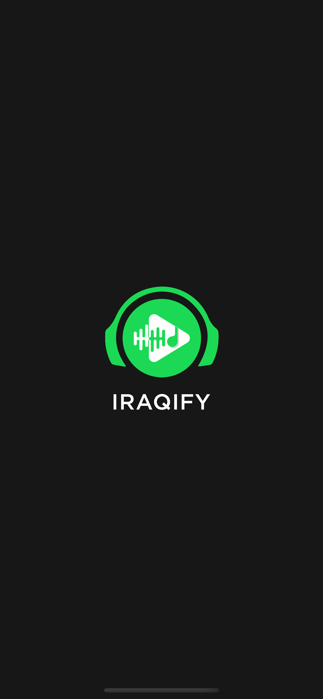
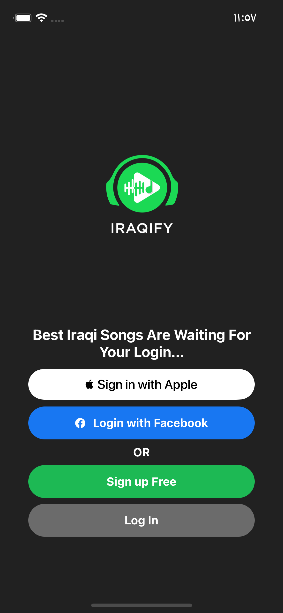
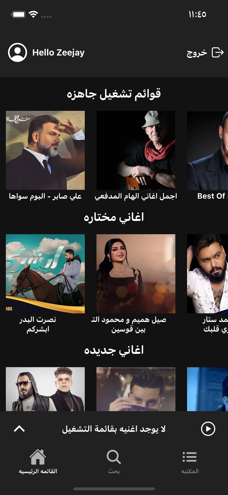
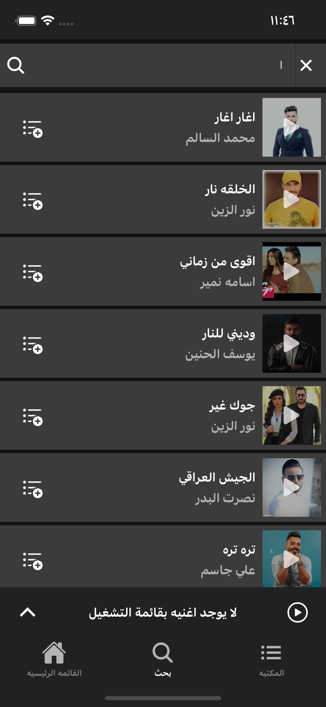
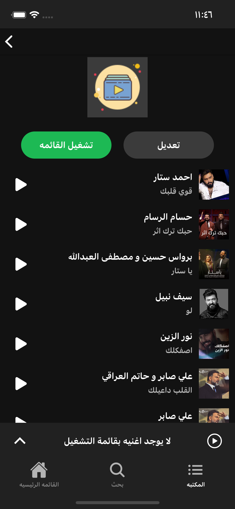
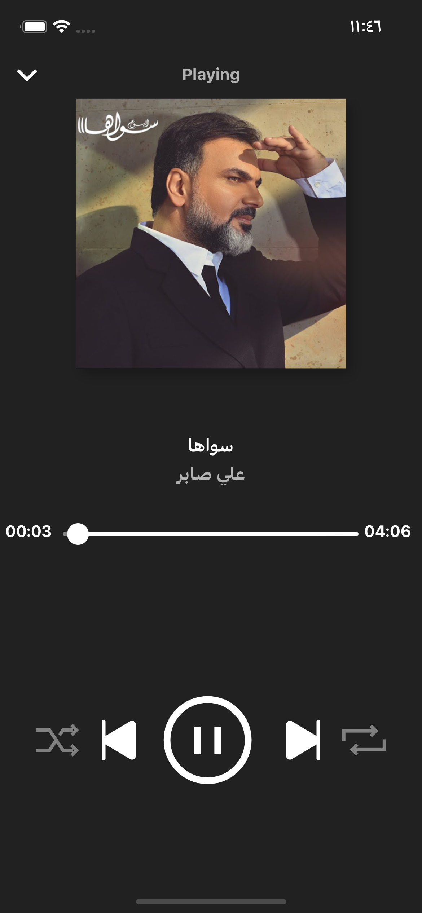

# Iraqify V2
Audio Streaming App just like spotify.

  
  
  
  
  
  

# FEATUERS
* Connected to a React CMS to update home screen with the newest songs.
* Auth service
* Most of spotify services, like playlists,seek,search, ...etc
* Remote push notification
* Version Checker 

# Running The App
download zip file and extract then do

npm install

* IOS:
cd ios then pod install

* Android:
go to android/build.gradle in buildscript make sure the buildToolsVersion number match the android sdk build tools in android studio, if not download it
